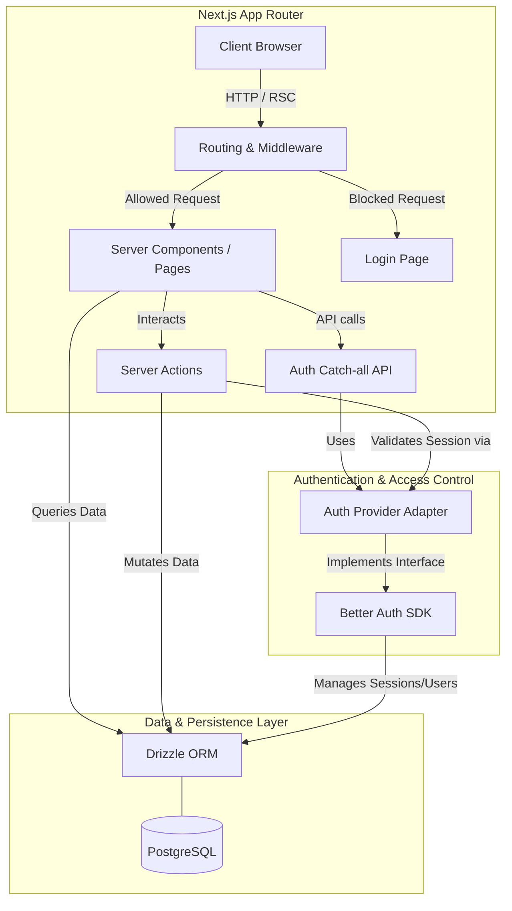
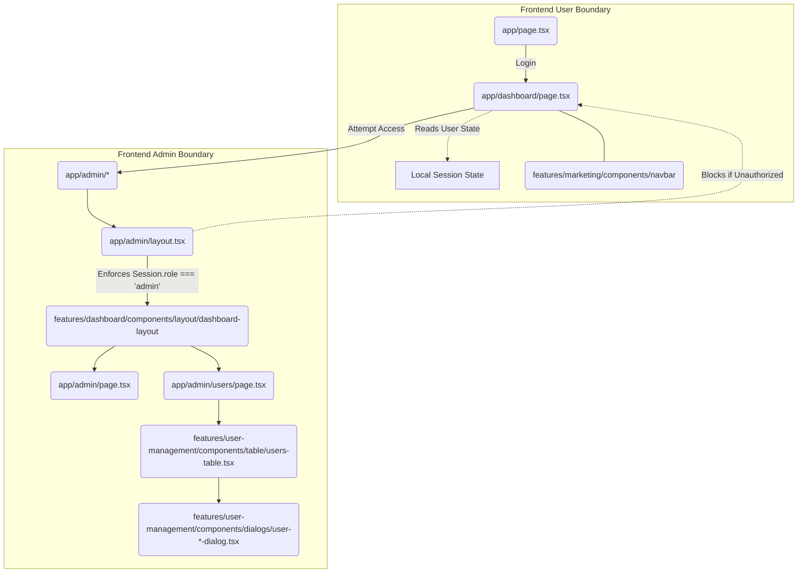
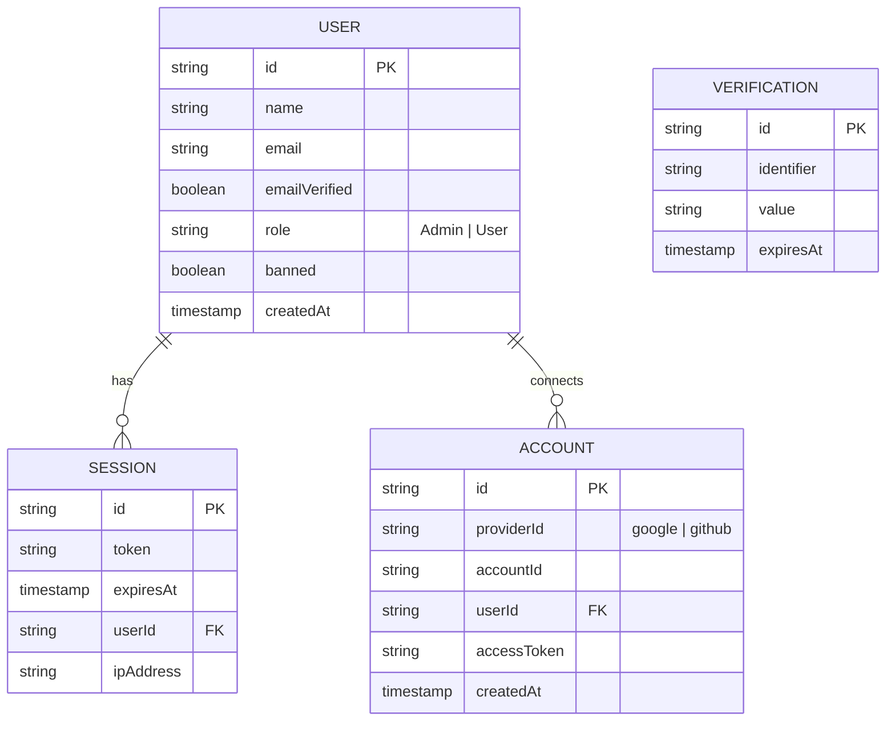
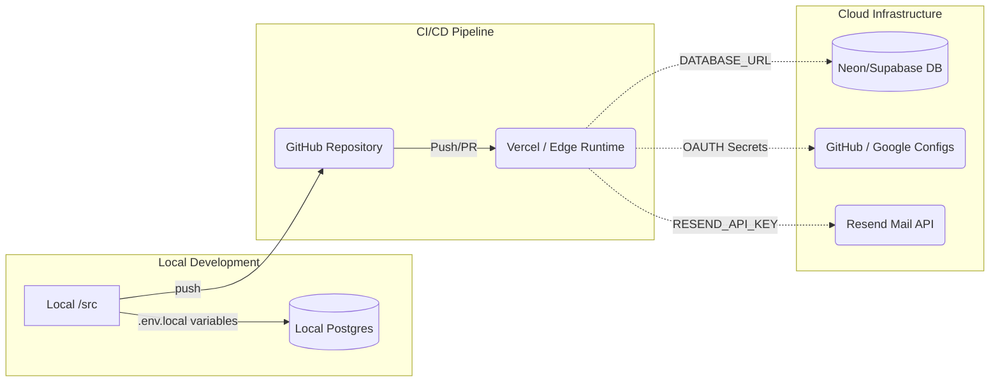

# Architecture Breakdown: Better Auth Starter

This document provides a highly comprehensive overview of the architecture, module boundaries, security model, and directory structure of the Better Auth Starter application.

## 1. High-Level Architecture & Data Flow

The project leverages a modern React framework to deliver a server-side rendered, secure, and type-safe application.

### 1.1 System Architecture Diagram



### 1.2 Data Flow Overview
1. **Routing & Delivery:** Requests utilize Next.js App Router. Layouts and Pages render natively on the server.
2. **Session Context:** Core access control relies on checking session state. Better Auth seamlessly bridges the UI and backend logic securely.
3. **Data Interfacing:** Server Components fetch initial view data entirely server-side using Drizzle ORM queries directly to PostgreSQL. React streams these HTML chunks progressively to the client.
4. **Client Interactivity:** Essential interactivity elements (forms, dialogs, dropdowns) rely on Client Components that execute API calls or Next.js Server Actions, revalidating data states efficiently.

## 2. Directory Structure

```text
better-auth-starter/
├── .github/                 # CI/CD configurations
├── .next/                   # Next.js build output
├── drizzle/                 # Drizzle migrations generated via drizzle-kit
├── src/
│   ├── app/                 # Next.js App Router Pages and Endpoints
│   │   ├── admin/           # Admin dashboard views (RBAC protected)
│   │   ├── api/             # API routes including `/api/auth/[...all]`
│   │   ├── auth/            # Auth pages (login, register)
│   │   ├── dashboard/       # Standard user dashboard
│   │   ├── layout.tsx       # Root React layout
│   │   └── page.tsx         # Main Landing Page
│   ├── components/          # Reusable UI components
│   │   └── ui/              # Radix UI + Tailwind generic primitives
│   ├── db/                  # Database connectivity logic
│   │   ├── index.ts         # pg Connection / Drizzle instance
│   │   └── schema.ts        # Table definitions
│   ├── features/            # Feature-Sliced Design domains
│   │   ├── auth/            # Authentication & identity module
│   │   │   ├── api/         # Login & register Server Actions
│   │   │   └── infrastructure/ # Hexagonal Ports & Adapters (DI)
│   │   ├── dashboard/       # Authenticated dashboard views
│   │   ├── marketing/       # Public-facing components (e.g., Navbar)
│   │   └── user-management/ # Administrative functions & user table
│   ├── hooks/               # Generic global React hooks
│   ├── lib/                 # Shared logic and libraries
│   │   ├── auth.ts          # BetterAuth core config on the server
│   │   ├── auth-client.ts   # BetterAuth client-side bindings
│   │   ├── public-paths.ts  # Hardcoded whitelist path config
│   │   ├── schemas.ts       # Core validation schemas using Zod
│   │   └── utils.ts         # Class merging and string formatting
│   └── proxy.ts             # Proxy abstractions
├── components.json          # UI registry configuration file
├── drizzle.config.ts        # Drizzle ORM generation settings
├── package.json             # Core dependencies (npm/pnpm setup)
└── tsconfig.json            # Typescript compliancy definitions
```

## 3. Core Modules Explained

### 3.1 Authentication & Security Model
**Core Files:** `src/features/auth/infrastructure/provider.ts`, `src/lib/public-paths.ts`

- **Hexagonal Architecture (Ports & Adapters):** The application relies on universally defined Auth Port Interfaces. All components safely import from `authClientProvider` or `authServerProvider` without knowing the exact SDK being utilized, enabling hot-swappable auth mechanisms.
- **SDK Implementation (Better Auth):** The current adapter wraps Better Auth behind our interface. It provides session tracking, JWT parsing, and OAuth efficiently via its internal `auth.ts` core configuration.
- **Role-Based Access Control (RBAC):** Admin privileges are defined generically across the app and supplied by the chosen adapter cleanly.
- **Resource Protection:** Routing logic validates incoming requests against whitelist configurations defined explicitly in `src/lib/public-paths.ts`. Paths like `/`, `/auth/*`, `/docs/*` bypass checks natively while protected views demand active session queries before data loading is permitted.

### 3.2 Database & schema Mapping (`src/db/`)
Highly type-safe integration tying closely into the user's core capabilities:
- **`schema.ts`**: Holds Postgres tables structured via `drizzle-orm/pg-core` constraints. Includes mapping for tracking standard attributes (e.g. `user`: Name, Email, Ban status) alongside technical models needed for identity tracking (`account`, `session`, `verification`).
- **`index.ts` & `drizzle.config.ts`**: Controls database synchronization allowing developers direct CLI utilities to `generate`, `push`, or `migrate` seamlessly into the target PostgreSQL cluster.

### 3.3 Visual & Functional Components (`src/components/ui`)
- **Radix UI Paradigm:** Forms the unstyled, highly accessible framework of foundational widgets like Popovers, Tooltips, Modals, and Select inputs.
- **Tailwind Setup:** Handles all design utility application. The system generates highly reproducible variants using `class-variance-authority`. Component styling merges fluidly inside the `cn()` utility (`src/lib/utils.ts`) resolving overriding classes efficiently via `tailwind-merge` resulting in dry, concise `.tsx` files.
- **Form Data Validation:** Integrated fundamentally into UI implementations via `react-hook-form` and schema enforcement via `zod`. Server-actions strictly process zod schemas mapped to user inputs avoiding backend validation inconsistencies.

## 4. Workflows

### Standard User Flow
1. User interacts with root layer components on unrestricted paths governed by `public-paths.ts`.
2. Hitting `/auth/login`, Better Auth processes OAuth/Credentials and binds a secure session directly to PostgreSQL.
3. Accessing `/dashboard`, server components inspect user state fetching localized content specifically targeting their mapped DB user identity.

### Admin Governance Flow
1. Elevated permissions (defined inside Better Auth RBAC as `admin`) grant view mapping into `src/app/admin/*`.
2. Admin components securely query server actions to enforce user mutations (Ban logic, privilege escalation, forced logouts via DB `session` wipeout) securely avoiding payload inspection overrides.

## 5. Frontend Architecture & Page Directory Maps

The frontend UI strictly segregates public landing spaces, user-level dashboards, and privileged administrative panels through nested directory layouts and distinct UI components.

### 5.1 Directory Layout Maps

**App Router Structure:**
```text
src/app/
├── admin/                        # Elevated Privileges Workspace
│   ├── layout.tsx                # Intercepts requests => requires `admin` session
│   ├── page.tsx                  # Admin Dashboard Status Page
│   └── users/page.tsx            # User Management Table View
├── dashboard/                    # Standard Authenticated Workspace
│   └── page.tsx                  # Generic User Dashboard UI (Cards, Quick Actions)
└── page.tsx                      # Public Marketing Root Page
```

**Feature Modules (Feature-Sliced Design):**
```text
src/features/
├── auth/                         # Identity logic & components
│   ├── api/                      # Login & register Server Actions
│   ├── components/               # Auth form components
│   ├── infrastructure/           # Hexagonal Ports & Adapters (DI layer)
│   │   ├── adapters/             # Concrete SDK implementations
│   │   ├── provider.ts           # Dependency Injection factory
│   │   └── types.ts              # Universal Port interfaces
│   └── schemas/                  # Zod validation bounded schemas
├── dashboard/                    # Core application functionality
│   ├── components/               # App Shell layout and dashboard views
│   └── config/                   # Nav and dashboard configurations
├── marketing/                    # Public site presentation
│   └── components/               # Navbar and landing components
└── user-management/              # Administrative capabilities
    ├── api/                      # Admin-only Server Actions (ban, roles, etc.)
    ├── components/               # User table, dialogs, administrative UI
    ├── hooks/                    # Domain-bound hooks (e.g. use-users-table)
    └── utils/                    # Domain-local formatting utilities
```

**Generic UI Components:**
```text
src/components/
└── ui/                           # Pure Radix UI & generic primitives only (no domain logic)
```

### 5.2 Frontend Boundaries Diagram



## 6. Database Entity-Relationship (ER) Schema

The architecture enforces strict relationship bounds internally. Below maps exactly how Drizzle constructs its underlying relationships within PostgreSQL.



## 7. Next.js API Routes & Server Actions Map

All state modification and network exchanges are carefully restricted between typical REST setups and native Server Actions to bypass unnecessary generic REST endpoints where security should be natively wrapped around the component.

### 7.1 Component Server Actions (Locally Bound)
Instead of relying exclusively on `/api/xxx` endpoints, domains directly export isolated server components executing mutations without generic `/api` exposure.
- `src/features/user-management/api/admin-actions.ts`: Exposes dedicated Server Actions like `banUser`, `setRole`, and `revokeUserSessions` natively to the `user-management` dialogs.
- `src/features/auth/api/login.ts` and `register.ts`: Keep core auth integrations bound closely to the identity feature domains.

### 7.2 Native Route Handlers (`src/app/api/`)
Explicit publicly accessible or internal-networking endpoints.
```text
src/app/api/
├── auth/[...all]/route.ts       # Identity catch-all logic. Implements `authServerProvider.getRouteHandler()` agnostically.
└── admin/users/route.ts         # REST bridge extracting standard User queries (allowing table pagination & indexing). Securely checks Admin session state before resolving payloads.
```

## 8. Deployment & Infrastructure Pipeline

The starter assumes a modern Edge or Serverless architecture natively, leveraging `.env.local` to securely bridge Next.js with third-party vendors.



## 9. Theming & Styling Architecture (Expanded Deep Dive)

The Better Auth Starter utilizes a deeply integrated **Tailwind CSS v4** setup augmented by **Radix UI components**, ensuring complete dark mode compatibility utilizing strictly OKLCH color spaces. The setup strips away traditional Node.js config complexity (no `tailwind.config.ts`) directly into a pure CSS orchestration layer.

### 9.1 CSS Variables & Design Tokens Deep Dive
Theming is orchestrated centrally in `src/app/globals.css`. By avoiding arbitrary HEX or RGB colors, it strictly utilizes **OKLCH (Organized Lightness, Chroma, Hue)**. OKLCH mathematically guarantees consistent contrast perception and scales perfectly between light and dark modes without muddying grays or blowing out highlights.

```mermaid
graph TD
    subgraph /src/app/globals.css Variable Engine
        ROOT[:root pseudo-class] -->|Sets Base OKLCH| BaseTheme(Light Mode Variables)
        DARK[.dark class] -->|Inverts/Adjusts OKLCH| DarkTheme(Dark Mode Variables)
    end
    
    subgraph Tailwind v4 Integration 
        BaseTheme --> InlineTheme[@theme inline]
        DarkTheme --> InlineTheme
        InlineTheme --> |Translates var--primary into .bg-primary| TWEngine(Tailwind Engine)
    end
```

### 9.2 Component Polymorphism & CVA Blueprint
Generic components inside `src/components/ui/` act as pure "dumb" styling boundaries. Rather than composing complex CSS logic natively across the app, UI boundaries are strictly handled by **Class Variance Authority (`cva`)** combined with **Radix Slot Polymorphism**.

#### Code Blueprint: `button.tsx` Deep Dive
A standard component like the `Button` relies heavily on exact, immutable styling boundaries. 

1. **Base Classes (`cva` mapping):** 
```typescript
const buttonVariants = cva(
    "inline-flex items-center gap-2 ... [&_svg]:size-4 cursor-pointer",
    { 
    variants: { 
        variant: { 
            default: "bg-primary text-primary-foreground shadow-xs", 
            destructive: "bg-destructive text-white...",
            outline: "border bg-background..."
        },
        size: { 
            sm: "h-8 rounded-md px-3", 
            lg: "h-10 rounded-md px-6" 
        } 
    },
    defaultVariants: {
        variant: "default",
        size: "default",
    }
    }
);
```
2. **SVG Icon Integrations (`lucide-react`):** Notice the strict `[&_svg]:size-4` arbitrary selector merged into the root `cva`. This guarantees that any icon explicitly passed as a child (e.g. `<Button><Mail/> Email</Button>`) perfectly inherits deterministic sizing relative to the DOM node avoiding manual icon prop drilling.

3. **Slot Polymorphism (`asChild` prop):**
```typescript
const Comp = asChild ? Slot : "button";
return <Comp className={cn(buttonVariants({ variant, size, className }))} {...props} />
```
Powered by `@radix-ui/react-slot`, developers can pass the `asChild` prop to wrap semantic primitives safely, e.g., `<Button asChild><Link href="/">...</Link></Button>`. Radix intelligently merges the UI rendering props of the `Button` down onto the semantic `<Link>` element, preventing bloated nested DOM wrappers natively.

### 9.3 The Property Merge Pipeline (`cn()`)
When combining default CVA variants with organic overrides injected by developers, CSS cascading framework failures are common. The architecture mitigates this purely through `src/lib/utils.ts`.

```typescript
export function cn(...inputs: ClassValue[]) {
  return twMerge(clsx(inputs));
}
```

**Execution Pipeline Example:**
1. A developer crafts: `<Button variant="destructive" className="bg-red-500 text-black" />`
2. `clsx()` merges the objects logically into an array: `["bg-destructive", "text-white", "bg-red-500", "text-black"]`
3. `tailwind-merge` analyzes the abstract class logic and recognizes:
   - `bg-destructive` and `bg-red-500` conflict geographically on `background-color`.
   - `text-white` and `text-black` conflict strictly on `color`.
4. It deterministically strips `bg-destructive` and `text-white` out, yielding a pure `"bg-red-500 text-black"` classstring output protecting layout integrity natively without using unpredictable `!important` overriding CSS rules.
