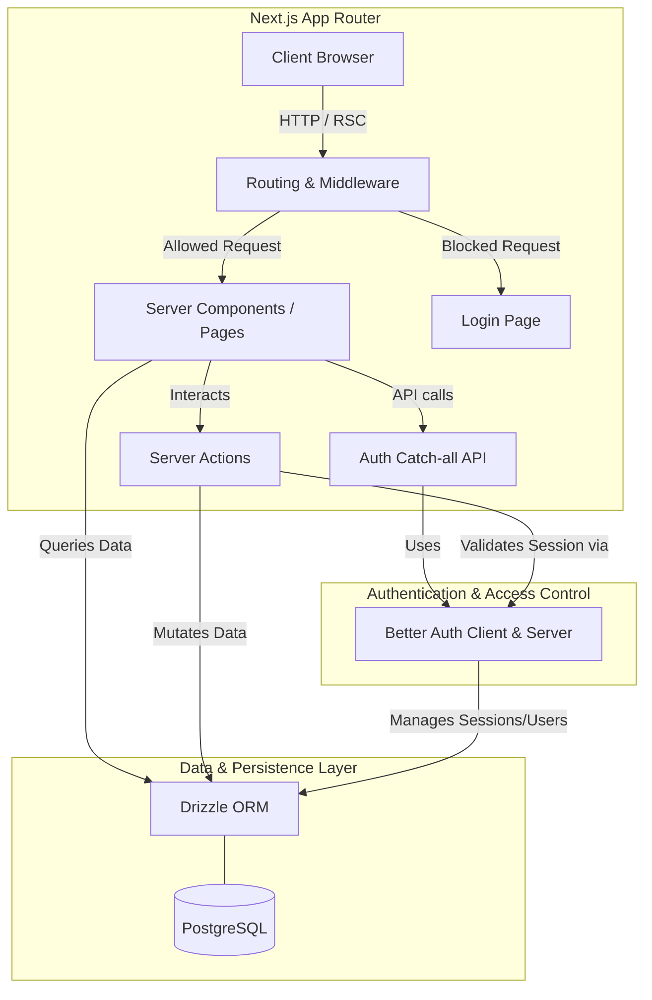
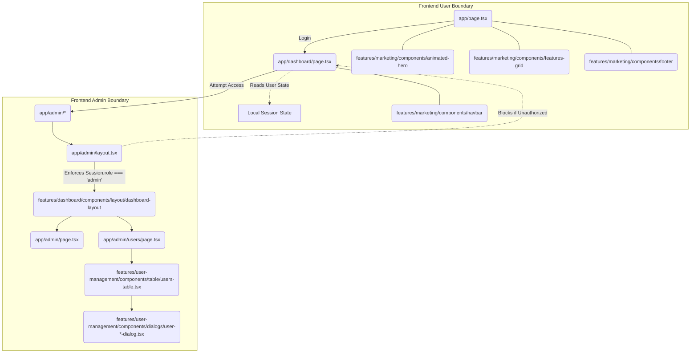

# 🚀 Multi-Tenant SaaS Starter

A modern, production-ready Next.js boilerplate with comprehensive authentication, domain-bound feature slicing, admin dashboard capabilities, and scalable user management. Redesigned by **Good Shepherd Insights, LLC.** for rapid application development.

---

## 🏗️ System Architecture & Data Flow

This application is built on a highly strict **Feature-Sliced Design (FSD)** architecture. Using Next.js App Router alongside Server Components and isolated Server Actions, the application completely decouples business logic from UI components.

### 1. The Request Lifecycle


### 2. Feature-Sliced Design (FSD) Directory Structure

The UI strictly segregates public landing spaces, user-level dashboards, and privileged administrative panels through nested directory layouts and distinct domain boundaries.

```text
src/
├── app/                    # Next.js App Router (Pages & Layouts)
├── components/             # Reusable UI components
│   └── ui/                 # Radix UI + Tailwind generic primitives
├── db/                     # PostgreSQL / Drizzle ORM config
├── features/               # Feature-Sliced Design domains
│   ├── auth/               # Identity, login forms, & auth schemas
│   ├── dashboard/          # Authenticated user dashboard views
│   ├── marketing/          # Public-facing presentation components
│   └── user-management/    # Admin views, tables, and server actions
├── hooks/                  # Global React hooks
└── lib/                    # Shared configuration and utilities
```

### 3. Component Rendering & Server Action Boundaries


---

## ✨ Core Application Features

### 🔐 Domain-Isolated Authentication
- **Better Auth Integration:** Provides core session tracking, JWT parsing, and OAuth handshakes strictly validated in `.eslintrc` and middleware.
- **Role-Based Access Control (RBAC):** Admin privilege is governed natively. Users are scoped to `admin` or `user` roles which map strictly to PostgreSQL.
- **Resource Protection:** Routing logic natively intercepts incoming requests using whitelist configurations (`public-paths.ts`).

### 👥 Strict User Management Domain
- **Server Actions Over REST:** Administrative functions (e.g., banning users or revoking sessions) route specifically through isolated Server Actions directly interacting with Drizzle ORM to avoid generic API exposure.
- **End-to-End Type Safety:** Deep schema validation utilizing `zod` directly bounding UI client forms to PostgreSQL tables.

### 🎨 Next-Generation UI/UX Pipeline
- **Tailwind v4 OKLCH:** Global styling completely skips standard RGB variables and relies heavily on the `OKLCH` framework for mathematically guaranteed contrast ratios natively inside CSS variables.
- **Component Polymorphism:** Elements use pure Radix UI primitives augmented heavily with Class Variance Authority (`cva`) logic ensuring immutable CSS component rules.
- **Dry Styling:** Advanced `tailwind-merge` natively intercepts dynamic design property injections preventing CSS cascading crashes.

---

## 🛠️ Stack Deep Dive

- **Framework:** Next.js 16 with App Router
- **Authentication:** Better Auth
- **Database:** PostgreSQL with Drizzle ORM
- **Styling:** Tailwind CSS v4 (Pure CSS Engine)
- **UI Components:** Radix UI (`components.json` controlled)
- **Validation:** Zod schemas
- **Email Pipeline:** Resend
- **TypeScript:** Strict full type safety rules enforced

---

## 🚀 Quick Start & Deployment Infrastructure

### Prerequisites

- Node.js 18+ 
- PostgreSQL database (Local or Hosted)
- Resend account (for email functionality)

### Installation

1. **Clone the repository**
    ```bash
    git clone <repository-url>
    cd multi-tenant-saas-starter
    ```

2. **Install dependencies**
    ```bash
    pnpm install
    ```

3. **Environment Setup**
   Copy the `.env.example` file to `.env.local` and apply your database connection strings.
   ```bash
   cp .env.example .env.local
   ```

4. **Database Database Synchronization**
   Execute the Drizzle ORM migrations connecting your UI to the Postgres instance.
    ```bash
    pnpm db:generate
    pnpm db:migrate
    ```

5. **Start Development**
    ```bash
    pnpm dev
    ```
Visit `http://localhost:3000` to preview the architecture natively mapping user state.

## 🔧 Available CLI Scripts

- `pnpm dev` - Start development server with Turbopack (Rapid compilation)
- `pnpm build` - Compile components into static/Edge ready outputs
- `pnpm start` - Spin up production server
- `pnpm db:generate` - Introspect Schema and generate `.sql` migrations
- `pnpm db:migrate` - Execute migration pushes to the live database
- `pnpm db:push` - Push database migrations to the database directly
- `pnpm db:studio` - Open the Native Drizzle local data viewer

---

## 🙋 Support & Licensing

For support and questions:
- Create an issue in this repository
- Contact the **Good Shepherd Insights** engineering team.

This project is licensed under the MIT License - see the LICENSE file for details.

---

**Modified & Maintained by Good Shepherd Insights, LLC.**

**Originally created by [Zexa](https://github.com/zexahq) - [better-auth-starter](https://github.com/zexahq/better-auth-starter)**